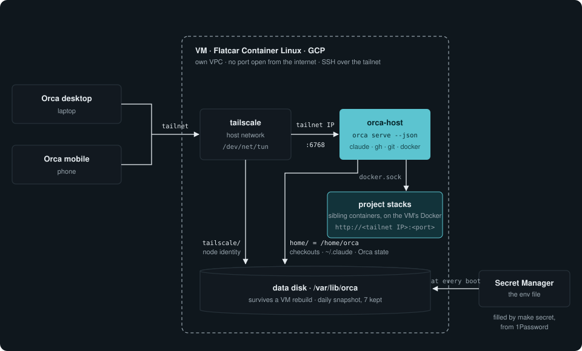
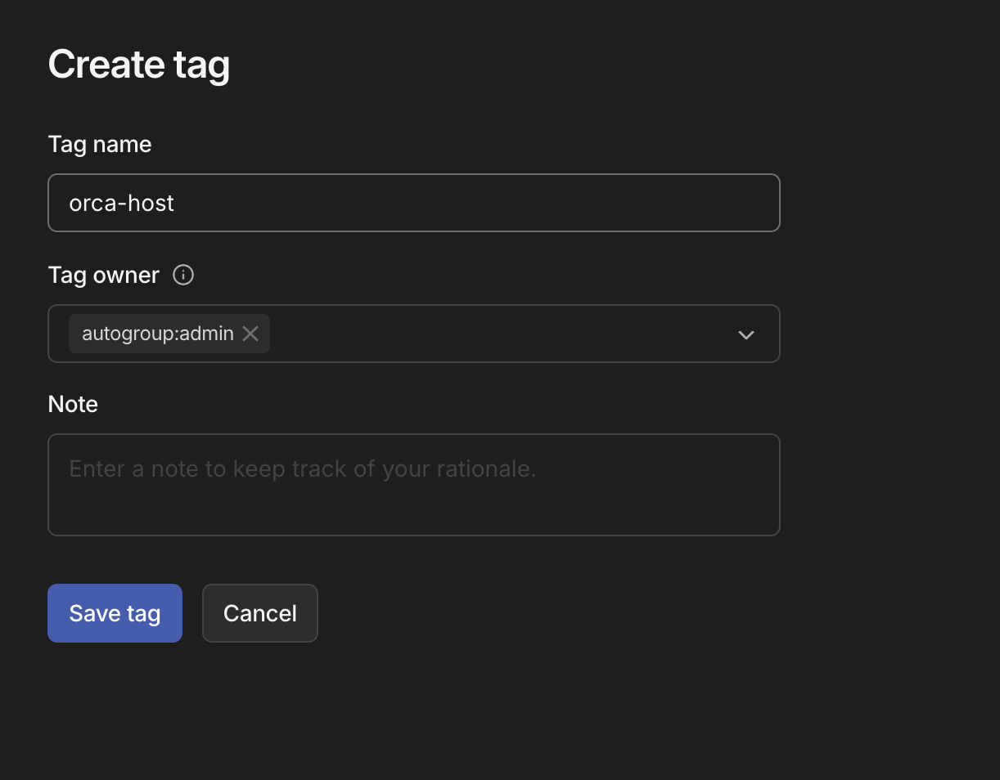
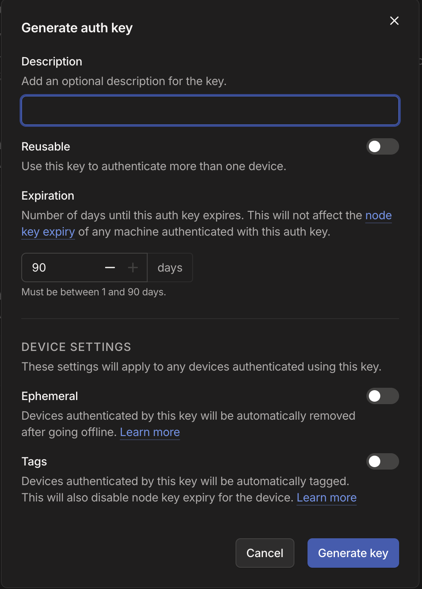
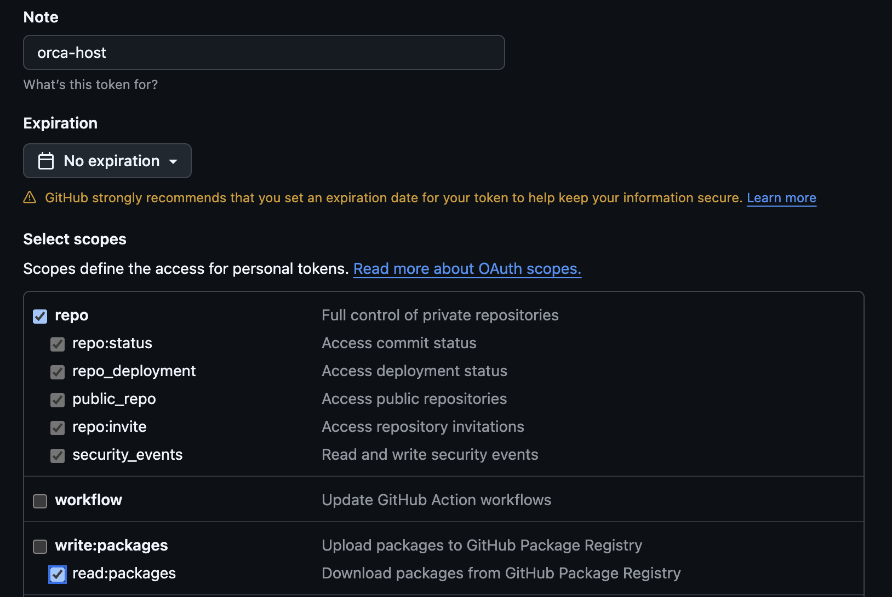
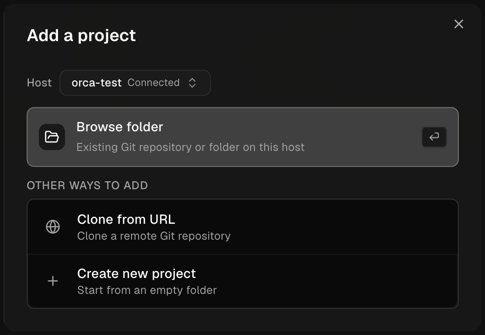
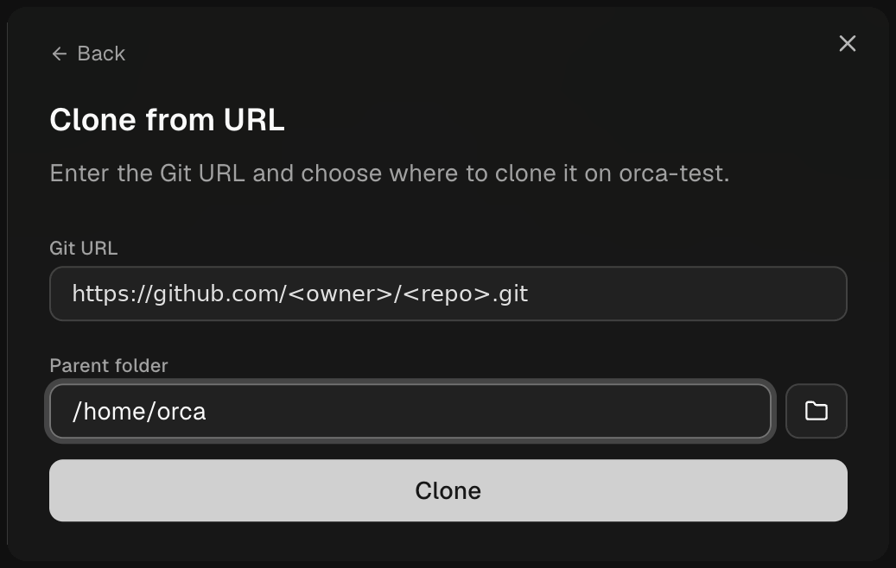

# orca-host

A headless [Orca](https://github.com/stablyai/orca) server on a GCP VM, used from the desktop and mobile Orca clients over the tailnet. One host per person, all of their projects on it.

Three layers, each usable without the one above: an image (`Dockerfile`, published as `ghcr.io/qrafttech/orca-host`), a stack (`compose.yaml`, driven by one env file), a host (`terraform/`, a VM on GCP that runs the stack). The image is a base: the tools you want on top of it are an image of your own, built `FROM` it. How it works and why: [`.claude/knowledge/`](.claude/knowledge/).



## What is configured where

| What | Where | Holds |
|---|---|---|
| The host | `terraform/terraform.tfvars` | name, GCP project, zone, 1Password vault, SSH public key; size and image reference, optional |
| You | the env file | Tailscale auth key, Claude token, GitHub token, git identity, Claude preferences |
| Your Claude settings | a git repository of yours, optional | permissions, `CLAUDE.md`, skills, MCP server declarations |
| Your tools | an image of yours, built `FROM` this one, optional | binaries, MCP servers, anything installed |
| A project | its own repository | `orca.yaml`, worktree scripts, `.env` files, compose, `.claude/` |

Nothing in this repository is per person or per project. The first two files are gitignored and come from 1Password: `terraform.tfvars` is the body of a Secure Note named `orca-host-tfvars`, the env file of one named `orca-host`, both in the vault `op_vault` names in the tfvars. `make` fetches a file when it is missing; edit the local copy freely, `rm` it to refetch. A line of the env note may point at another item, `FOO_TOKEN={{ op://Vault/Item/field }}`: `op inject` resolves it, so a token lives once, in its own item — and the vault must be that same one, since a service account is scoped per vault.

The env file:

```
TS_AUTHKEY=tskey-auth-...                   Tailscale admin console → Settings → Keys: reusable off, ephemeral off, tag orca-host
CLAUDE_CODE_OAUTH_TOKEN=...                 `claude setup-token` on the laptop
GH_TOKEN=...                                classic personal access token, scopes `repo` + `read:org`
GIT_AUTHOR_NAME=...
GIT_AUTHOR_EMAIL=...
CLAUDE_PERMISSION_MODE=auto                 optional, see Claude settings
CLAUDE_SETTINGS_REPO=me/claude              optional, see Claude settings
CLAUDE_SETTINGS_FILE=config/settings.json   optional: where settings.json is in that repository
FOO_TOKEN={{ op://Vault/Item/field }}       anything else reaches the container as is: the `${FOO_TOKEN}` of your MCP servers, what your own tools read
```

The host renders that note itself, at every boot. Secret Manager holds one line — the token of a 1Password service account, read-only on that one vault — and `make secret` puts it there, once. So a token you rotate in 1Password, or a variable you add to the note, is a `make restart` away; nothing is frozen at the moment it was uploaded. On a laptop, `make env` renders the same note with your own account, into `./env`.

## Install

Needed on the laptop: `docker`, `terraform`, `gcloud`, `op` (1Password CLI), `jq`, `ssh`, `qrencode`, the Orca desktop CLI.

1. **Once per tailnet**: a tag `orca-host` with owner `autogroup:admin`, in the Tailscale admin console → Access controls → Tags. Tagged nodes never expire.

   

2. **Once per GCP project**: `gcloud auth application-default login` (Terraform's login, separate from `gcloud auth login`), then `make bootstrap` for the state bucket.
3. **A 1Password vault for the host**, technical: the tokens your agents read, no password data. A service account on it, read-only, its token saved in an item named `orca-host-service-account` in that same vault. `make secret` reads it from there; the host never does, it gets the token from Secret Manager.
4. **The two Secure Notes**, in that vault: `orca-host-tfvars` is `terraform/terraform.tfvars.example` filled in; `orca-host` is the env file above. Fine-grained GitHub tokens do not work; the organisation must allow classic ones. The first fetch is the only one that cannot read the vault name from the tfvars: `make OP_VAULT="<vault>" init`.

    

5. **The host**:

   ```bash
   make init      # once per checkout
   make apply     # VPC, service account, secret, data disk, VM
   make secret    # the 1Password service-account token into Secret Manager
   make pair      # the desktop client, then the phone
   ```

   `make pair-desktop` registers the server in the desktop app; then Settings → Remote Orca Servers → Advanced → Active Server. `make pair-mobile` shows a QR code to scan from the phone (Tailscale on, same tailnet). Both pairings survive restarts and rebuilds.

## Projects

Add one from the app: Add a project → Clone from URL, the https URL, parent folder `/home/orca` (the repository name is appended). Git authenticates through `gh` with `GH_TOKEN`: no login, no key.

 

Everything a project needs is in its repository and runs from its worktree setup hook: `docker compose` on the VM's Docker, `.env` files, base images. What it starts is reachable at `http://<tailnet IP>:<port>`. Deleting a worktree from Orca tears its stack down within 5 minutes, volumes included. Claude Code in a worktree works as on a laptop: the project's own `.claude/` and `CLAUDE.md` apply on top of your settings, hooks run in the container (`ruby`, `python3`, `node` are there), and workspace trust is asked once per project.

**Project secrets.** `op` is in the image, and the host hands its service-account token to every session: a session reads the host's vault itself, so a project whose dev `.env` lives in 1Password is brought up by its own setup hook, `op inject -i .env.tpl -o .env`, with no step on a laptop. That token is in every session's environment, so everything a session runs can read that vault: that is why the vault is technical and read-only. In Claude Code's `auto` mode, `op` also needs an allow rule in your settings repository: the permission classifier refuses it as credential materialization.

## Claude settings

Two optional variables in the env file. Neither set: Claude's defaults.

- `CLAUDE_PERMISSION_MODE`: `default`, `acceptEdits`, `auto` or `plan`, the permission mode of Claude panes.
- `CLAUDE_SETTINGS_REPO`: `<owner>/<repo>`, your Claude settings versioned in git, pulled at every start. What is taken from it:

  | In the repository | On the host |
  |---|---|
  | `permissions` in `CLAUDE_SETTINGS_FILE` (default `settings.json`) | `~/.claude/settings.json`; hooks and status lines are not taken |
  | `CLAUDE.md` at the root | `~/.claude/CLAUDE.md` |
  | `.claude/skills/` | `~/.claude/skills` |
  | `config/mcp.json` | user-level MCP servers; their `${VAR}` come from the env file |

  Text only, pulled at every start: changing a permission is a `git push` and a `make restart`, never a rebuild. Software is the next section. Formats: [claude-settings.md](.claude/knowledge/claude-settings.md).

## Your own tools

The image names no tool of yours: `claude`, `gh`, `git`, the Docker CLI, `op`, `ruby`, `python3`, `node` — what the host itself runs on, and nothing beyond. A binary or an MCP server you want on the host goes in an image of yours, built `FROM` this one — the repository that holds your Claude settings is the natural place for it:

```dockerfile
FROM ghcr.io/qrafttech/orca-host:main@sha256:<digest>
RUN curl -fsSL -o /tmp/x "<url>" && echo "<sha256>  /tmp/x" | sha256sum -c - \
 && install -m 755 /tmp/x /usr/local/bin/<tool> && rm /tmp/x
```

`/usr/local/bin` is on the PATH of every session already. Your CI builds and pushes it; make it public — it holds no secret, and the host then needs no registry login. Point the host at it:

```
orca_image = "ghcr.io/me/orca-host:main"   # terraform.tfvars
```

That is an Ignition change, so once: `terraform -chdir=terraform apply -replace=google_compute_instance.vm`. From then on a new build under the same tag needs nothing: the host checks the tag every five minutes and redeploys itself when the digest has moved, as for any other image change.

**Keeping up with the base.** Pin the `FROM` to a digest, as above, and let Dependabot watch it — in your repository, `.github/dependabot.yml`:

```yaml
version: 2
updates:
  - package-ecosystem: docker
    directory: /
    schedule: { interval: daily }
```

Every time `main` moves here, you get a pull request bumping that digest, your CI builds it, and you merge when you want it. The digest is what makes a build reproducible: without it the `FROM` resolves to whatever the tag serves that day.

## Updates

| You changed | What happens | You do |
|---|---|---|
| this repository, merged to `main`; the host runs the base image | the host redeploys within five minutes of the build | nothing |
| this repository, merged to `main`; the host runs your own image | Dependabot opens a pull request in your repository, within a day | merge it: next row |
| your own image, merged to its `main` | your CI builds it; the host redeploys within five minutes | nothing |
| the env note, or a token it references | nothing until the next restart | `make restart` |
| your settings repository: permissions, `CLAUDE.md`, skills, `config/mcp.json` | pulled at every start of the container | `make restart` |
| `compose.yaml`, `terraform/ignition.yaml.tftpl`, `orca_image` | nothing: Ignition runs at first boot only | `terraform -chdir=terraform apply -replace=google_compute_instance.vm` |

- **Redeploy**: the host sees a new image under the tag it follows and restarts its container on it.
- **Restart** (`make restart`): the env file rendered again from 1Password, the container restarted, the image pulled.
- **Rebuild** (`apply -replace`): a new VM, from Ignition.

All three end live terminals, and all three keep the data disk: checkouts, Tailscale identity, pairing, Docker's images and the volumes of project stacks. To stay on one build, name its `sha-<sha>` tag in `orca_image`: the host then never redeploys by itself.

## Day to day

```bash
make restart   # re-render the env file, re-run the stack, take a new image now; ends live terminals
make logs
make shell     # a shell in the container, as `orca`, the same paths an Orca terminal sees
make ssh       # a shell on the VM, as `core`
```

Docker is what fills the data disk over time: `docker system prune` from `make shell`, and a worktree's archive script should `docker compose down -v`.

## Develop

Every push builds the image for amd64 and arm64, tagged `<branch>` and `sha-<sha>`; `orca_image` in `terraform.tfvars` is the full reference a host runs, so a `sha-<sha>` tag or a digest pins it to a build. On a Mac, `make build` builds `orca-host:dev` and `make up` runs it with Docker Desktop, on the laptop's own tailnet IP; `make up ORCA_IMAGE=<reference>` runs any other one.
